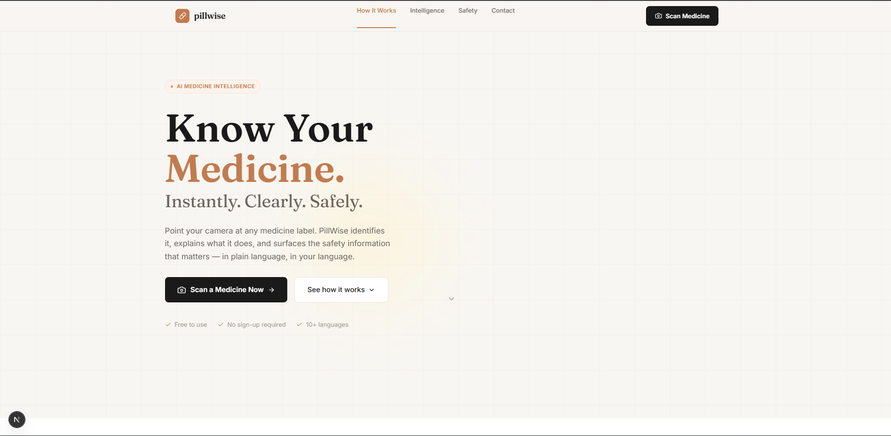
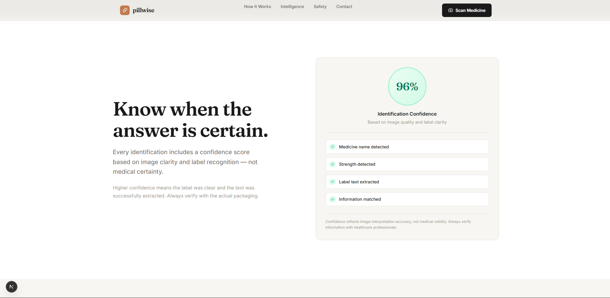
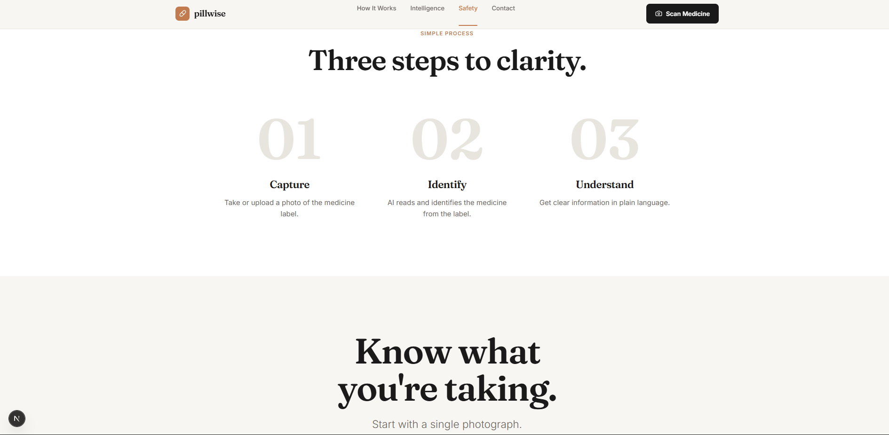
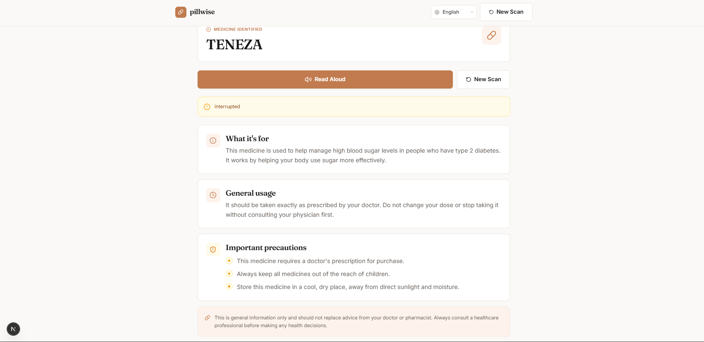
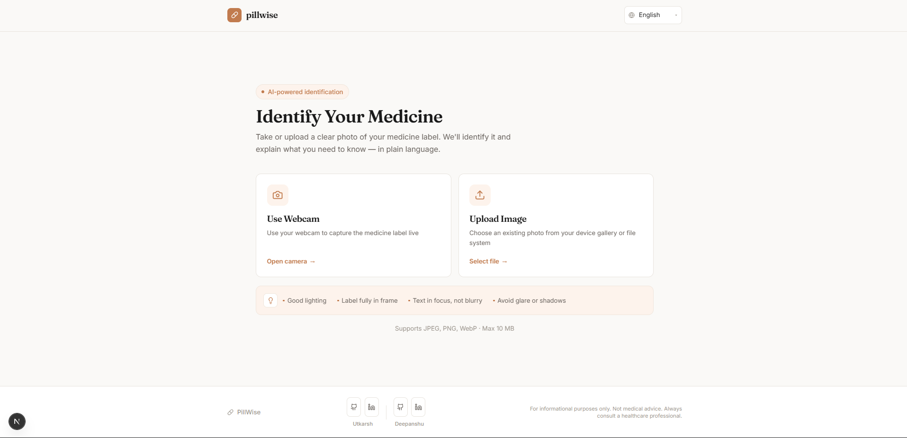

<div align="center">

# 💊 PillWise

### Know Your Medicine. Instantly. Clearly. Safely.

**An accessibility-first AI medicine reader that transforms a photograph of a medicine label into clear, understandable information.**

<br>

[](https://gdg.community.dev/gdg-prayagraj/)
[](https://ai.google.dev/)
[](https://nextjs.org/)
[](https://fastapi.tiangolo.com/)
[](https://www.python.org/)

<br>

📷 **Capture** &nbsp; → &nbsp; 🧠 **Identify** &nbsp; → &nbsp; 💡 **Understand** &nbsp; → &nbsp; 🔊 **Listen**

</div>

---

## 🩺 The Problem

Medicine packaging contains critical information, but accessing that information is not always easy.

Tiny typography, unfamiliar medicine names, abbreviations, warnings, and technical terminology can create a frustrating barrier between a person and the medicine in their hand.

This becomes especially difficult for:

- 👴 Elderly users
- 👁️ People with visual difficulties
- 🧑‍🦽 People who benefit from hands-free interaction
- 🌍 Users unfamiliar with medical terminology
- 👨‍👩‍👧 Anyone trying to quickly understand an unfamiliar medicine

The problem is not always a lack of information.

**The problem is accessibility to that information.**

---

# 💊 What is PillWise?

**PillWise** is a camera-first, accessibility-focused AI medicine information assistant.

Instead of manually reading a medicine strip, searching the internet, or trying to understand unfamiliar terminology, users can simply capture a photograph of the medicine.

PillWise processes the visible label information and presents it in a structured, easy-to-understand format.

### The experience is built around four simple steps:

**📷 Capture → 🔍 Identify → 🧠 Understand → 🔊 Listen**

No account.

No complicated forms.

No unnecessary typing.

Just point, capture, and understand.

> ⚠️ **PillWise is an informational and educational aid, not a diagnostic, prescription, or treatment tool. Results should always be verified with a doctor or pharmacist.**

---

# ✨ What PillWise Does

| Feature | What it does |
|---|---|
| 📷 **Camera Capture** | Capture a medicine label directly using a device camera |
| 🖼️ **Image Upload** | Upload an existing photograph of a medicine |
| 🔍 **AI Identification** | Analyze visible packaging information and identify the medicine when possible |
| 📝 **OCR / Text Extraction** | Extract visible text from the medicine package |
| 🧠 **Plain-Language Explanation** | Turn technical information into easier-to-understand language |
| 🔊 **Voice Output** | Read important results aloud |
| ♿ **Accessibility First** | Large typography, clear hierarchy, and minimal interaction |
| 🛡️ **Safety Information** | Surface general precautions and safety messaging |
| ⚡ **Fast Workflow** | Minimize the steps between capturing an image and understanding it |

---

# 🛠️ Tech Stack

<div align="center">

| Layer | Technology |
|---|---|
| **Frontend** | Next.js (App Router), TypeScript, Tailwind CSS |
| **Voice Output** | Web Speech API (browser-native text-to-speech) |
| **Backend** | FastAPI (Python) |
| **AI / LLM** | Google Gemini API via `google-genai` SDK (routed through OmniRoute) |
| **Data Validation** | Pydantic (structured request/response schemas) |
| **Frontend Hosting** | Vercel |
| **Backend Hosting** | Render |
| **Version Control** | Git + GitHub |

</div>

**Why this stack:**
- **Next.js + FastAPI**, kept as two focused services rather than one monolith — frontend handles capture/UI/voice, backend owns all AI orchestration and stays swappable
- **Gemini (multimodal)** handles both image understanding and language generation in a single provider, avoiding a separate OCR pipeline
- **Pydantic + `response_schema`** enforce structured JSON output from Gemini directly, instead of parsing free-text responses
- **No database, no auth** — by design. Everything lives in-session; there's nothing to protect, store, or leak

---

# 📸 Product Showcase

## 🏠 Landing Experience

A clean entry point focused on one primary action:

**Scan a medicine.**

<p align="center">
  
</p>

---

## 🔬 Medicine Intelligence

PillWise presents medicine information in a structured interface instead of overwhelming users with raw medical terminology.

<p align="center">
  
</p>

---

## 🛡️ Safety & Confidence

The interface communicates that confidence is based on image clarity and label recognition, not medical certainty.

<p align="center">
  
</p>

---

## 💊 Medicine Profile

The result experience brings together the information users actually need to understand the medicine.

<p align="center">
  
</p>

---

## 📷 Scan Experience

The core interaction:

**Point → Capture → Process → Understand**

<p align="center">
  
</p>

---

# 🧠 How It Works

PillWise uses a simple capture-to-understanding pipeline, split cleanly across two services.

```text
┌──────────────────────┐
│      📷 CAPTURE      │
│                      │
│   Camera / Upload    │
└──────────┬───────────┘
           │
           ▼
┌──────────────────────┐
│     🔍 IDENTIFY      │
│                      │
│   Image → AI / OCR   │
└──────────┬───────────┘
           │
           ▼
┌──────────────────────┐
│    🧠 UNDERSTAND     │
│                      │
│ Plain-language       │
│ explanation          │
└──────────┬───────────┘
           │
           ▼
┌──────────────────────┐
│      🔊 ACCESS       │
│                      │
│     Read + Listen    │
└──────────────────────┘
```

### End-to-end request flow

```text
              User
               │
               │  Capture / Upload Image
               ▼
       Next.js Frontend
               │
               │  Base64 Image
               ▼
       POST /api/identify
               │
               ▼
       FastAPI Backend
               │
               │  Image Processing
               ▼
       Gemini / OmniRoute
               │
               │  Structured Identification
               ▼
       Medicine Information
               │
               ▼
       POST /api/explain
               │
               ▼
         AI Explanation
               │
               ▼
          Result Screen
               │
               ├── Read on screen
               │
               └── 🔊 Read aloud
```

---

# 🚀 Getting Started

### Prerequisites

- Node.js 18+
- Python 3.10+
- A [Gemini API key](https://aistudio.google.com/apikey)

### 1. Clone the repository

```bash
git clone https://github.com/shadesofuttu/pillwise.git
cd pillwise
```

### 2. Set up the backend

```bash
cd backend
python -m venv venv
source venv/bin/activate      # Windows: venv\Scripts\activate

pip install -r requirements.txt

cp .env.example .env
# Add your GEMINI_API_KEY inside .env

uvicorn main:app --reload
```

Backend runs at `http://127.0.0.1:8000` — confirm it's alive at `GET /health`.

### 3. Set up the frontend

```bash
cd ../frontend
npm install

cp .env.example .env.local
# Set NEXT_PUBLIC_API_URL to your backend URL (e.g. http://127.0.0.1:8000)

npm run dev
```

Frontend runs at `http://localhost:3000`.

### 4. Try it out

Open the app, capture or upload a clear photo of a medicine label, and let PillWise do the rest.

---

# 🗺️ Roadmap

- [ ] Multi-language support for explanations (not just UI)
- [ ] Offline-first fallback for low-connectivity areas
- [ ] Medicine interaction warnings across multiple scans
- [ ] Native mobile app for improved camera performance

---

# ⚖️ Disclaimer

PillWise provides general informational content generated by AI and **is not a substitute for professional medical advice, diagnosis, or treatment**. Always consult a qualified doctor or pharmacist regarding any medicine, dosage, or health concern.

---

# 🙏 Acknowledgements

Built at the **GDG Prayagraj Vibe Coding Hackathon** (July 2026), under the theme *AI for Everyday Life*.

---

# 📄 License

This project is licensed under the [MIT License](LICENSE).

---

<div align="center">

Made with care by [Utkarsh](https://github.com/shadesofuttu) and [Deepanshu](https://github.com/Deepanshu046)

</div>
